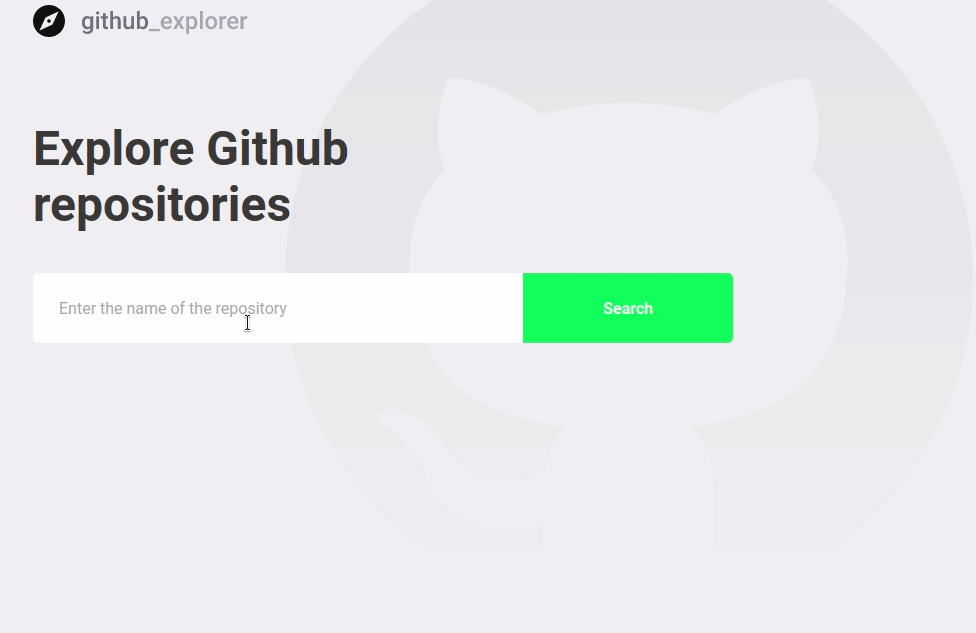

<h1 align="center">
  
   
   
  Github Explorer
</h1>

<h4 align="center">
  Explore repositories from Github and view their issues. 
</h4>

<h6 align="center">
  Developed with ReactJS + Typescript during Rocketseat's Bootcamp GoStack.
</h6>

 

  <a href="#prerequisites">Prerequisites</a> |
  <a href="#setup">Setup</a> |
  <a href="#usage">Usage</a>

# Prerequisites

* [Node.JS](https://nodejs.org/)
* [Yarn](https://classic.yarnpkg.com/)

# Setup

1. First clone this repository;
2. Open a terminal window and navigate to the root folder;
3. Type `yarn` to install all project dependencies;
4. Execute `yarn start` to run the app.

# Usage

On the first screen, type `[username]/[repository]` on the input area to search for a user repository. The result will be appended to a list below of previously searched repositories. The list will be saved on the local storage of the navigator.

If you wish to see more details about a repository, you can click on the list item and see its current issues.

# Improvements

- Add validation to check if user is searching for an already saved repository on the list;
- Allow user to delete a repository from the list of saved repositories;
- Refactor functions inside components to be called with useCallback hook (to prevent unecessary function allocations).
- Better stylying on input search;
